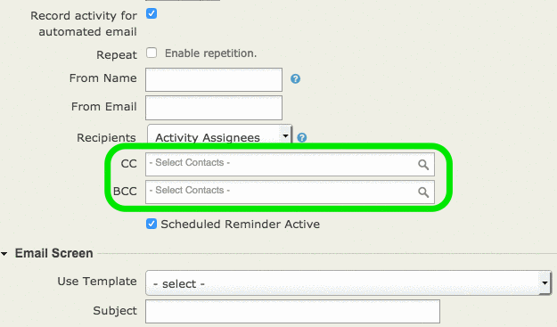

Scheduled Reminder CC/BCC Recipients for CiviCRM
------

This extension provides extra fields on the CiviCRM Scheduled reminder screen, allowing you to send a carbon copy or blind carbon copy of the reminder to additional contacts.

This allows you to, for example, send a copy of a scheduled reminder to an event coordinator when a participant signs up.

Installation
------

1. To allow use of CC/BCC Recipient fields, download and apply patch to CiviCRM: [civcirm-core-reminder-tokens.patch](civcirm-core-reminder-tokens.patch)
1. Download the [latest version of this extension](https://github.com/agileware/au.com.agileware.scheduledccrecipients/archive/master.zip)
1. Unzip in the CiviCRM extension directory, as defined in 'System Settings / Directories'.
1. Go to "Administer / System Settings / Extensions" and enable the "Scheduled Reminder CC Recipients (au.com.agileware.scheduledccrecipients)" extension.

Usage
------

When creating a new scheduled reminder, add additional contacts using the CC and BCC fields that are added to this form:

When the reminder is sent, these Contacts will be emailed in addition to the Recipients configured for the reminder.

About the Authors
------

This CiviCRM extension was developed by the team at [Agileware](https://agileware.com.au).

[Agileware](https://agileware.com.au) provide a range of CiviCRM services including:

  * CiviCRM migration
  * CiviCRM integration
  * CiviCRM extension development
  * CiviCRM support
  * CiviCRM hosting
  * CiviCRM remote training services

Support your Australian [CiviCRM](https://civicrm.org) developers, [contact Agileware](https://agileware.com.au/contact) today!

