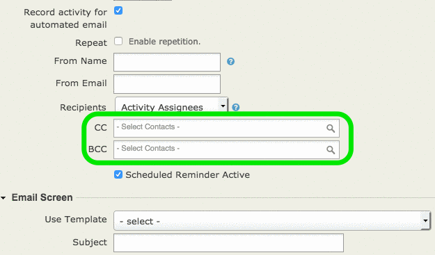

# Scheduled Reminder CC Recipients (au.com.agileware.scheduledccrecipients)

This is a [CiviCRM](https://civicrm.org) extension that adds CC and BCC fields to the
**Scheduled Reminders** (Schedule Reminders) form, allowing you to send a carbon copy or blind
carbon copy of a scheduled reminder email to additional contacts who are not themselves recipients
of the reminder.

This is useful, for example, if you want to notify an event coordinator or staff member whenever a
scheduled reminder email is sent to a Participant, Member, or other recipient, without needing to
add that person as a recipient of the reminder itself.

The extension is licensed under [AGPL-3.0](LICENSE.txt).

## Important: Requires a CiviCRM core patch

This extension **requires a patch to CiviCRM core** to function. Without the patch, the CC and BCC
fields will appear on the Scheduled Reminders form and will save correctly, but the extra
recipients will **not** receive the emails when the reminder is sent.

The patch, [civcirm-core-reminder-tokens.patch](civcirm-core-reminder-tokens.patch), adds a
`token_params` entry to the parameters CiviCRM core passes to `hook_civicrm_alterMailParams` in
`CRM/Core/BAO/ActionSchedule.php`. This extension's `hook_civicrm_alterMailParams` implementation
checks for `token_params` to identify the mail as a scheduled reminder send, and only then applies
the extra CC/BCC addresses.

Apply the patch to your CiviCRM core codebase before (or after) installing this extension. If your
CiviCRM version has already merged an equivalent change upstream, confirm whether the patch still
applies or is still required for your version before applying it.

## Getting Started

1. Apply [civcirm-core-reminder-tokens.patch](civcirm-core-reminder-tokens.patch) to your CiviCRM
   core codebase (see above).
2. Install and enable this extension (see [Installation](#installation-web-ui) below).
3. No further configuration is required. No settings page, API keys, or additional permissions are
   needed beyond the standard CiviCRM permission to administer Scheduled Reminders
   (`administer CiviCRM` / access to "Administer / Communications / Schedule Reminders").

## Usage

1. Go to "Administer / Communications / Schedule Reminders" and add or edit a Scheduled Reminder.
2. New **CC** and **BCC** fields appear on the form, immediately after the **From Email Address**
   field. Use these to select one or more CiviCRM Contacts to receive a copy or blind copy of the
   reminder email.

   

3. Save the Scheduled Reminder as usual. The CC/BCC contacts are stored against that reminder.
4. When the Scheduled Reminder job runs and sends the reminder email, the selected CC and BCC
   contacts' email addresses are added to the outgoing message in addition to the reminder's
   configured recipients.

If a CC or BCC contact has no email address, or has multiple/no matching email, they are silently
skipped for that address type (only contacts with a resolvable email are included).

### Data storage and API

CC/BCC selections are stored per-reminder in a custom table (`civicrm_scheduledreminderdata`),
linked to the Scheduled Reminder (`ActionSchedule`) by `reminder_id`. This extension exposes a
`ScheduledReminderData` API (v3) with standard `get`, `create`, and `delete` actions, should you
need to inspect or script against this data directly.

## Requirements

* CiviCRM 5.51+
* The CiviCRM core patch described above ([civcirm-core-reminder-tokens.patch](civcirm-core-reminder-tokens.patch))

## Installation (Web UI)

Learn more about installing CiviCRM extensions in the [CiviCRM Sysadmin
Guide](https://docs.civicrm.org/sysadmin/en/latest/customize/extensions/).

Remember to also apply the required core patch (see above) - the extension will install and its
fields will display without it, but the CC/BCC recipients will not actually be emailed.

## About the Authors

This CiviCRM extension was developed by the team at
[Agileware](https://agileware.com.au).

[Agileware](https://agileware.com.au) provide a range of CiviCRM
services including:

* CiviCRM migration
* CiviCRM integration
* CiviCRM extension development
* CiviCRM support
* CiviCRM hosting
* CiviCRM remote training services

Support your Australian [CiviCRM](https://civicrm.org) developers,
[contact Agileware](https://agileware.com.au/contact) today!

